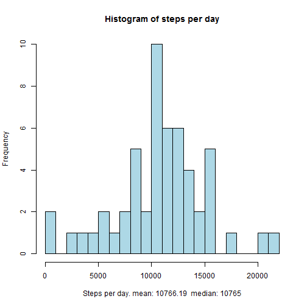
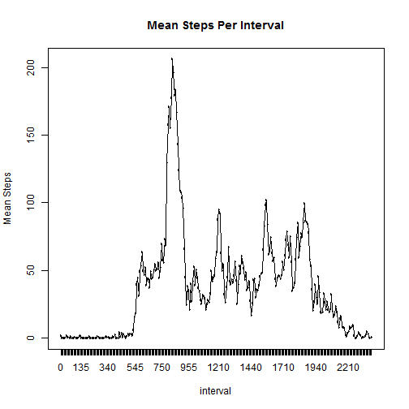
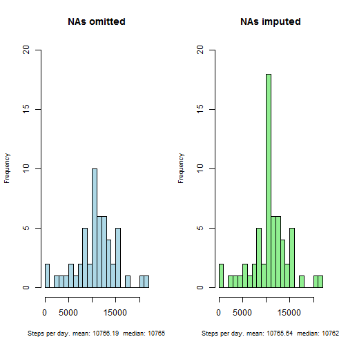
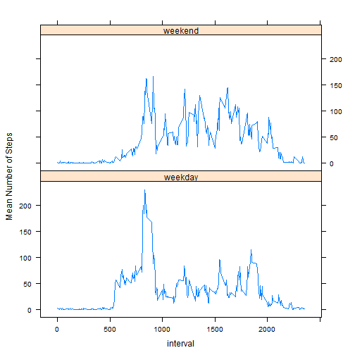

The following is a brief analysis of activity data collected by a single person
wearing a fitness tracker.  The data contains step counts in 5 minute intervals
over a two month span.


--------------------------------------------------------------------------------------
## Loading and preprocessing the data

First things first, let's load the data...


```r
library(data.table)
dd <- read.csv("activity.csv")
dt <- data.table(dd)
```


## What is the mean total number of steps taken per day?


First let's make a histogram of steps per day (ignoring NA values for the moment).


```r
# filter out NAs, then sum the steps by date. 
steps.per.day <- dt[!is.na(dt$steps),sum(steps),by=date]

m <- mean(steps.per.day$V1)
md <- median(steps.per.day$V1)

# include mean/median in the xlab
hist.xlab <- paste("Steps per day. mean:", round(m,2), " median:", md)

# plot histogram with breaks every 1000 steps (max steps in the data ~ 21000)
hist(steps.per.day$V1, 
     breaks=seq(0,22000,1000), 
     col="lightblue", 
     xlab=hist.xlab, 
     main="Histogram of steps per day")
```

 


Each bar in the histogram represents a range of 1000 steps.  As you can see 
the histogram approximates a normal distribution centered around 10,000-11,000 steps. 
The mean steps per day is 10766 and the median is 10765.
This corresponds with what we see in the histogram.


--------------------------------------------------------------------------------------
## What is the average daily activity pattern?


Let's analyze the daily activity pattern by computing the mean average steps
for each 5-minute interval, across all days in the dataset.


```r
# calculate the average steps per interval across all days (ignoring NAs)
steps.per.interval <- dt[!is.na(dt$steps),mean(steps),by=interval]

# coerce interval into a factor, otherwise R will treat it as an integer,
# which we don't want since the interval values represent an hour and minute
# of the day, so the minute values cycle between 0 and 60, leaving big
# gaps between 60 and 100, which would show up as gaps in the plot if the
# interval value were treated as an integer.
steps.per.interval <- transform(steps.per.interval, interval=factor(interval))

# Since I coerced the x values into a factor, I can't use type="l" to generate
# a line.  So I'll use plot+lines instead.
with(steps.per.interval, plot(interval,V1,type="n"))
with(steps.per.interval, lines(interval,V1))
title(main="Mean Steps Per Interval",xlab="interval",ylab="Mean Steps")
```

 

Most step activity occurs in the morning, prior to 10 AM. Let's find the interval
with the maximum average steps:


```r
# Find the interval with the max average steps
steps.per.interval[V1==max(steps.per.interval$V1),]
```

```
##    interval       V1
## 1:      835 206.1698
```


So the interval with the maximum average steps across all days is 8:35 AM,
with ~206 steps.  That's probably around the time every morning 
when this person went to work or class or whatever.


--------------------------------------------------------------------------------------
## Imputing missing values


First let's quickly determine the number of complete cases vs. the number of rows with NAs


```r
num.complete <- sum(complete.cases(dt))
num.na <- sum(is.na(dt$steps))
```


The total number of complete cases (i.e rows without NAs) is 15264.
The number of rows with NAs is 2304. 

Let's fill in the NA values with imputed data.  We'll use the average steps per interval,
as calculated above, to fill in the missing step data according to the row's interval.


```r
#
# @param spi steps.per.interval data frame
# @param intv the interval
#
# @return the average steps for the given interval.
# 
getMeanStepsPerInterval <- function(spi,intv) {
    # round off the spi mean and convert to an int
    as.integer( round(spi[interval==intv, ]$V1, 0) )
}

# make a copy of the original dataset and fill in the missing values.
dt2 <- dt
for (i in 1:nrow(dt2)) {
    if ( is.na(dt2[i]$steps) ) {
        dt2[i]$steps <- getMeanStepsPerInterval(steps.per.interval,dt2[i]$interval)
    }
}
```


Now let's plot a histogram of steps per day, this time using the imputed values, and compare
that to the original dataset.


```r
# filter out NAs, then sum the steps by date. 
steps.per.day2 <- dt2[,sum(steps),by=date]

m2 <- mean(steps.per.day2$V1)
md2 <- median(steps.per.day2$V1)

# include mean/median in the xlab
hist.xlab <- paste("Steps per day. mean:", round(m,2), " median:", md)
hist2.xlab <- paste("Steps per day. mean:", round(m2,2), " median:", md2)

# plot the two histograms side by side
par(mfrow=c(1,2), cex.lab=0.75)

hist(steps.per.day$V1, 
     breaks=seq(0,22000,1000), 
     col="lightblue", 
     xlab=hist.xlab, 
     main="NAs omitted", 
     ylim=c(0,20))
hist(steps.per.day2$V1, 
     breaks=seq(0,22000,1000), 
     col="lightgreen", 
     xlab=hist2.xlab, 
     main="NAs imputed", 
     ylim=c(0,20))
```

 


As you can see, the histograms are mostly identical except for the bar in the middle, which on the imputed
side has an additional 8 days in the middle range of 10,000-11,000 steps.  This corresponds to the 8 days that are missing data in the original
dataset.  The imputed values for those days are all the same and, when summed up per day, equal 
the average steps per day, 10766, which falls in the middle bar.  So all 8 days got added to the middle
bar, while the other bars remained unchanged.

The mean and median are slightly different between the two datasets.  This is likely due to rounding errors introduced
in the getMeanStepsPerInterval function, which rounds off the mean steps per interval to an integer.


--------------------------------------------------------------------------------------
## Are there differences in activity patterns between weekdays and weekends?


Let's look at the activity patterns on weekdays vs. weekends.  We'll use the dataset
with imputed data for this.  First we create a new column (daytype) that indicates whether the
date is a "weekday" or "weekend" day.  Then we compute the mean steps per interval separately
for weekdays and weekends.  Finally we generate a panel plot comparing the two results.


```r
#
# @param dates a vector of dates
#
# @return "weekday" if the given date falls on a weekday, "weekend" otherwise.
#
isWeekdayOrWeekend <- function(dates) {
    weekend.days <- c("Saturday", "Sunday")
    days <- weekdays(as.Date(dates))
    sapply( days, function(d) { ifelse(d %in% weekend.days, "weekend", "weekday") }, USE.NAMES=F )
}

dt2$daytype <- as.factor( isWeekdayOrWeekend( dt2$date ) )
steps.per.interval.weekdays <- dt2[daytype=="weekday",mean(steps),by=interval]
steps.per.interval.weekends <- dt2[daytype=="weekend",mean(steps),by=interval]

# combine and plot
steps.per.interval.weekdays$daytype <- "weekday"
steps.per.interval.weekends$daytype <- "weekend"
spi <- rbind(steps.per.interval.weekdays, steps.per.interval.weekends)

library(lattice)
xyplot(V1 ~ interval | daytype, type="l", data=spi, layout=c(1,2), ylab="Mean Number of Steps")
```

 


The plots show a pattern on the weekdays where steps are high prior to 10:00 AM
and much lower afterwards.  Whereas on the weekends, the steps are more evenly
distributed throughout the day.  


